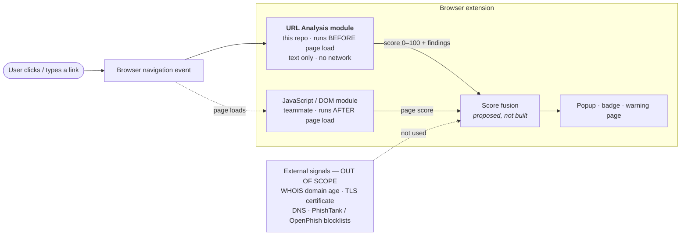
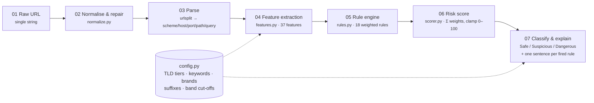
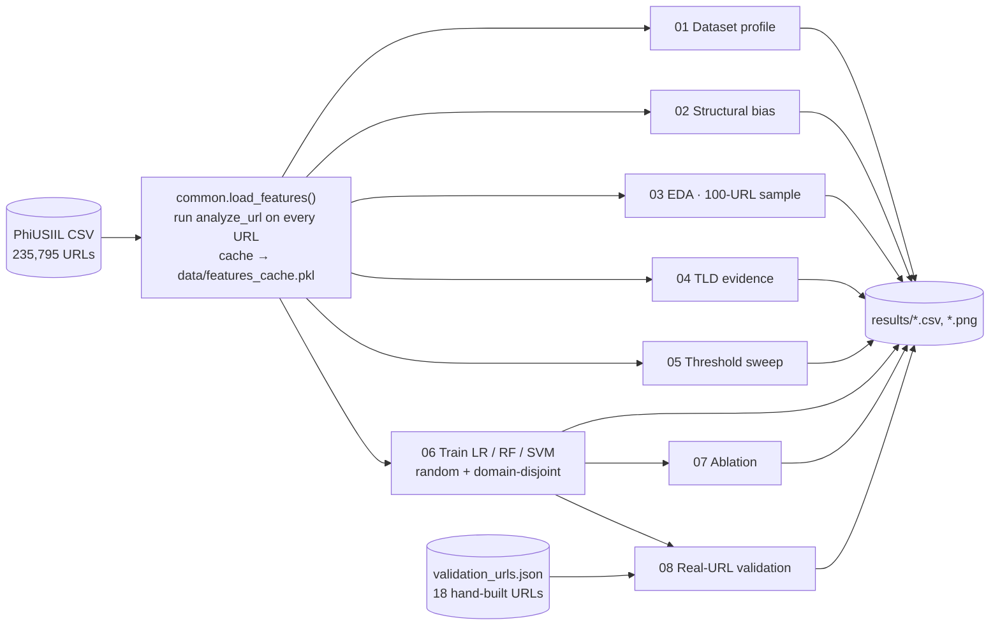

# URL Analysis Module — Architecture

Group SY503 · Browser Extension for Phishing Detection · Module owner: Bhakti Deshmukh · Rev 1.1

---

## 1. Where this module sits in the extension

The extension has two detection modules. **URL Analysis runs first**, before the browser fetches the page, using only the URL string. The **JavaScript/DOM module** (owned by a teammate) runs after the page loads and sees page content. A fusion step, not built yet, combines the two scores.



Why text-only matters: it is the cheap first-pass filter. It costs about **0.02 ms per URL in JavaScript** (0.05 ms in Python), makes no network request, and never tells a third party which sites the user visits. Anything it cannot know from the string — domain age, certificate, page content — is deliberately left to other components.

---

## 2. Internal pipeline (7 stages)



| Stage | File | What it does | Failure behaviour |
|---|---|---|---|
| 01 Raw URL | — | Input: one string | `None`, `""`, non-string → `Unknown` |
| 02 Normalise & repair | `normalize.py` | Trim; add `http://` if scheme missing (flag `no_scheme`); drop `#fragment`; convert Unicode host to punycode | Returns `parse_ok = 0`, never raises |
| 03 Parse | `normalize.py` | `urllib.parse.urlsplit` → scheme, host, port, path, query | Bad port (`:99999`, `:abc`) → `parse_ok = 0` |
| 04 Feature extraction | `features.py` | 33 numeric model features + 4 descriptive fields = 37 | All 37 keys always present |
| 05 Rule engine | `rules.py` | 18 rules, each `(id, condition, weight, finding)` | Skipped when `parse_ok = 0` |
| 06 Risk score | `scorer.py` | `score = clamp(Σ wᵢ·firedᵢ, 0, 100)`; weights −20 … +25 | — |
| 07 Classify & explain | `scorer.py` | Bands **Safe 0–5 · Suspicious 6–19 · Dangerous 20–100** | `Unknown` if unparseable |

---

## 3. Repository layout

```
url-analysis/
├── url_analyzer/              ← the module (Python, standard library only)
│   ├── config.py              lists + thresholds (TLD tiers, keywords, brands, bands)
│   ├── normalize.py           stages 02–03
│   ├── features.py            stage 04 — 37 features
│   ├── rules.py               stage 05 — 18 rules
│   ├── scorer.py              stages 06–07 — analyze_url()
│   └── cli.py                 python -m url_analyzer "<url>"
├── js/
│   ├── url-analyzer.js        ← JavaScript port for the extension (identical output)
│   ├── example-background.js  how the extension calls it (Manifest V3)
│   └── test/parity.test.js    JS must match Python on 2,133 URLs
├── evaluation/                ← scripts that reproduce every table in the report
│   ├── 01_dataset_profile.py  02_structural_bias.py  03_eda_sample.py
│   ├── 04_tld_evidence.py     05_threshold_sweep.py  06_train_models.py
│   ├── 07_ablation.py         08_validate_real_urls.py   run_all.py
├── tests/                     pytest suite + validation_urls.json + parity fixture
├── results/                   CSV/PNG outputs of the evaluation scripts
├── data/                      put the PhiUSIIL CSV here (not committed)
└── docs/ARCHITECTURE.md       this file
```

---

## 4. Output contract (what other modules receive)

`analyze_url(url)` in Python and `URLAnalyzer.analyzeUrl(url)` in JavaScript return the same object:

```json
{
  "url": "http://paypal.com.secure-account-verify.tk/signin",
  "score": 64,
  "classification": "Dangerous",
  "indicators": ["R02", "R09a", "R10", "R12", "R14"],
  "findings": [
    "Domain uses a top-level domain offered for free and heavily abused (.tk/.ml/.ga/.cf/.gq).",
    "URL contains multiple authentication or payment related keywords.",
    "A well-known brand name appears in the URL but is not the registered domain.",
    "URL uses HTTP instead of HTTPS, so traffic is not encrypted.",
    "Registered domain name looks randomly generated."
  ],
  "features": { "url_length": 49, "num_subdomains": 2, "...": "all 37 features" }
}
```

| Field | Type | Meaning |
|---|---|---|
| `score` | int 0–100 | Higher = riskier |
| `classification` | `Safe` · `Suspicious` · `Dangerous` · `Unknown` | Bands 0–5 / 6–19 / 20–100; `Unknown` = could not parse |
| `indicators` | string[] | IDs of fired rules (R01 … R17) |
| `findings` | string[] | One plain-English sentence per fired rule, for the popup |
| `features` | object | All 37 features (for logging, ML, debugging) |

---

## 5. Integration with the JavaScript module — open questions

The fusion step is not built. Both modules must agree on:

1. **Scale** — both 0–100? (URL module: yes)
2. **Direction** — higher = riskier? (URL module: yes)
3. **Fallback** — if the page never loads, the URL score alone decides.
4. **Override rules** — e.g. a password field on a `Dangerous` URL → always block.

---

## 6. Offline evaluation pipeline



The ML models are **evaluation baselines only**. The shipped module is the rule engine, because on real URLs it scored 15/18 against the Random Forest's 10/18 (report p.11).

---

## 7. Design decisions

| Decision | Reason |
|---|---|
| Text-only, no network | Runs before page load; fast; private |
| Transparent weighted rules, not ML | Explains every score; beat the ML model on real URLs |
| Recompute every feature from the URL | Dataset columns are not portable to JS; two are wrong (`URLSimilarityIndex` leakage, `IsHTTPS` disagrees with the URL text) |
| Never raise an exception | Called on every navigation; a crash would break browsing |
| Python for research, JS for the extension | Same logic, checked by `parity.test.js` (0 mismatches on 2,133 URLs; 20,133 checked during development) |
| TLD lists derived from data | `evaluation/04_tld_evidence.py`; `.dev/.app/.co/.io` excluded on purpose |
